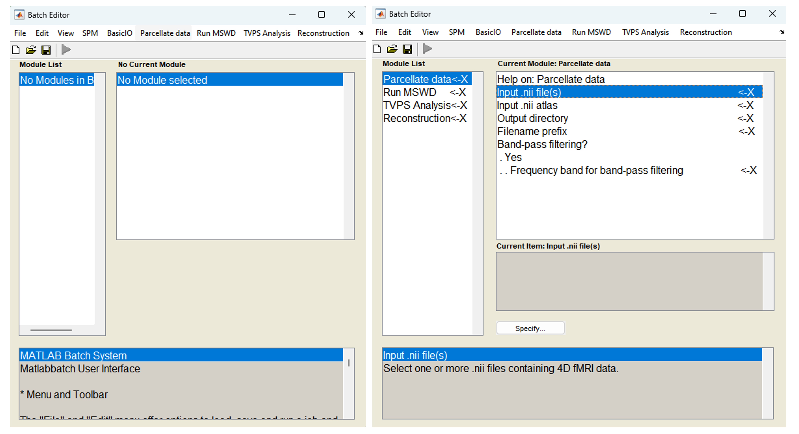
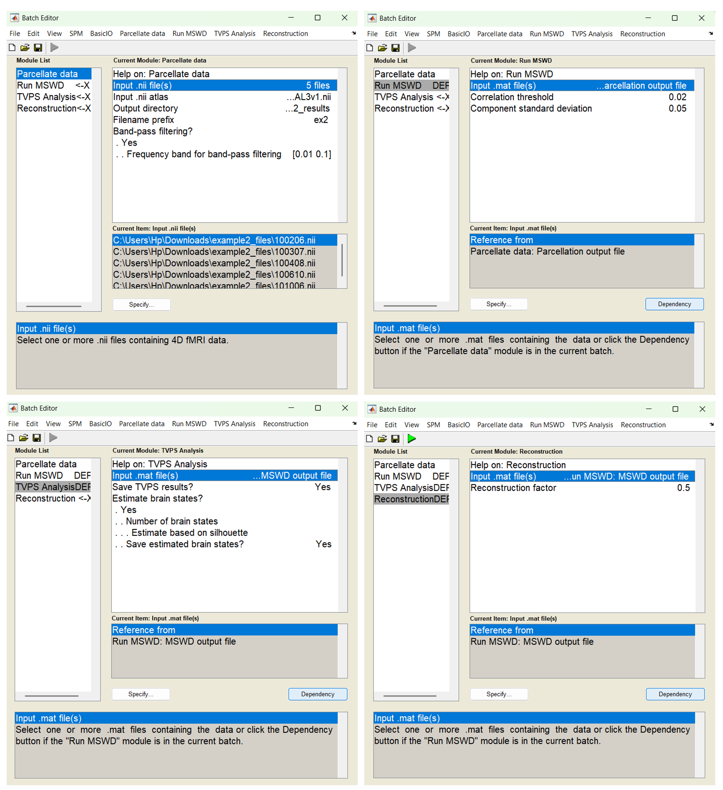

# MSwD-PS_Toolbox
MSwD-PS is a MATLAB toolbox for computing time-varying phase synchronization (TVPS) from fMRI data using Multivariate Swarm Decomposition (MSwD).

The toolbox supports analyses such as those presented in:

Lamprou, Charalampos, et al.
Robust fMRI time-varying functional connectivity analysis using multivariate swarm decomposition.
Neurocomputing 642 (2025): 130404.

The toolbox is available in two versions:

1) Standalone version
Operates on pre-extracted fMRI time series obtained via atlas-based parcellation or spatial Independent Component Analysis (ICA).
SPM-compatible version

2) Integrates with SPM12 and supports end-to-end processing directly from volumetric rs-fMRI data, including parcellation, decomposition, TVPS estimation, and reconstruction.

# Requirements
- MATLAB R2021a or later
- Signal Processing Toolbox
- SPM12 (only for the SPM-compatible version)

The toolbox has been tested on MATLAB 9.10.0 (R2021a) under Windows. Compatibility with earlier MATLAB versions is not guaranteed.

# Standalone Version
**Initialization**
Add the toolbox to the MATLAB path and launch the graphical interface:
```matlab
addpath(genpath('C:\path\to\MSWD_Toolbox'))
mswd_ps_main;
```
A graphical interface similar to the one shown below will appear.


Click "Select Files & Run". Two dialog windows will then open successively:
1) Select the input files
2) Select the output directory

Afterward, a series of dialog windows will appear, requesting analysis-related parameters.


Each dialog window includes default values to simplify usage for new users. In multiple-choice windows, the default option is highlighted in light blue, while text-entry windows contain pre-filled default values.

**Input Parameters**
Output Prefix: The first dialog window requests a filename prefix that will be used when saving pipeline outputs.

**MSwD Parameters**
The next two windows request the following MSwD parameters:
- $Corr_{th}$: correlation threshold (the default value is `0.02`)
- $StD_{th}$: component standard deviation threshold (the default value is `0.05`)

Users interested in experimenting with these parameters are encouraged to consult our publication for additional methodological details.

**Save Decomposed Signals**
The next window asks whether the decomposed fMRI time series should be saved as .mat files.

**Analysis Options**
The user is then prompted to select one of the following analysis modes:
- TVPS
- REC
- both

**TVPS Analysis**
If TVPS is selected, the cosine of the relative phase (CRP) is computed between the Hilbert-transform phases of the dominant oscillatory modes for all possible region pairs.

This produces an R×R×T matrix for each input file, representing dynamic phase-based functional connectivity across all brain regions.

The next window asks whether the resulting CRP matrices should be saved as .mat files.

Then, the window showed at the left of the figure below will pop up. By clicking "Select Files & Run", two more windows will succesively open, asking for the input files and the output directory respectively.

**Brain State Estimation**
The user is then asked whether to perform brain state estimation using the TVPS data.

Additional details regarding this procedure can be found in our Neurocomputing publication.

The user can either:

- manually specify the number of brain states for K-means clustering, or
- automatically estimate the optimal number of states using the silhouette score

If manual specification is selected, an additional dialog window requests the number of brain states.

**Reconstruction Analysis (REC)**

If REC is selected, the toolbox performs signal reconstruction using differential weighting of the:

- global component: sum of oscillatory modes returned by MSwD
- local component: residual signal

In our Neurocomputing study, assigning lower weights to the global component improved functional connectivity performance in:

- subject fingerprinting
- ASD classification

The user is asked to specify the reconstruction parameter:

lambda: weighting factor applied to the global component

The default value is: `0.5`

**Combined Analysis**

If both is selected, the toolbox performs both:

- TVPS analysis
- reconstruction analysis

# SPM-Compatible Version

**Requirements**
The SPM-compatible version requires SPM12 to be installed first.

SPM12 can be downloaded from:

https://www.fil.ion.ucl.ac.uk/spm/

**Initialization**

Run the following commands in the MATLAB Command Window:
```matlab
addpath C:\path\to\spm12
addpath(genpath('C:\path\to\MSWD_Toolbox'))
spm('fmri','defaults')
```

**Adding the Modules**
In the SPM main window:

1) Click Batch to open the Batch Editor
2) Go to: File -> Add Application
3) Add the following modules one by one: spm12_parcellate.m, spm12_mswd.m, spm12_tvps.m, spm12_reconstruct.m

The figure below illustrates the Batch Editor before and after adding all modules.



**Module Overview**
The following modules are available:
- `spm12_parcellate.m`: Extracts regional fMRI time series from volumetric rs-fMRI data
- `spm12_mswd.m`: Performs Multivariate Swarm Decomposition
- `spm12_tvps.m`: Computes TVPS and optional brain state estimation
- `spm12_reconstruct.m`: Performs signal reconstruction

The decomposition, TVPS, brain state estimation, and reconstruction modules use the same parameters as the standalone version.

The main additional feature of the SPM-compatible version is the parcellation module, which enables direct processing of volumetric fMRI data.

**Running the Pipeline**
All fields marked with ->X must be specified.

Once all required fields are completed, the Run Batch button turns green, allowing execution of the pipeline.

The figure below illustrates all four modules fully configured.



**Parcellation Module**
In the first module:

- Select the input `.nii` rs-fMRI files
- Select an atlas
- Specify an output prefix
- Choose whether to apply band-pass filtering

If filtering is enabled, specify the desired frequency band.

In the example shown above:

- five rs-fMRI `.nii` files are selected
- the AAL3 atlas is used
- the output prefix is `ex2`
- band-pass filtering is enabled
- the frequency band is `[0.01 0.1]` Hz

**MSwD Module**
The second module requires:

- input `.mat` files
- $Corr_{th}$
- $Std_{th}$

When the module follows the parcellation step, the user can use the Dependency button to directly use the outputs of the previous module as inputs.

In the second module (top right panel), the required variables include the input .mat files, the correlation threshold ($Corr_{th}$), and the component standard deviation threshold ($StD_{th}$). Since the "Run MSWD" module follows the "Parcellate data" module, the user can use the "Dependency" button to pass the output of the "Parcellate data" module directly as the input. Similarly, in the third and fourth modules (bottom left and right panels, respectively), the input .mat files can be specified via the "Dependency" button as the output of the "Run MSWD" module.

In addition to the input files, the third module requires the user to specify whether to save the TVPS results and to configure parameters related to brain state estimation, as in the standalone version. The fourth module requires the user to set a value for the reconstruction factor $\lambda$. For all variables, a help window at the bottom of the Batch Editor provides additional information and default values where applicable.

Notably, the four modules can also be executed independently. For example, if the "Parcellate data" module has already been run in a previous session, the user can ommit it from the module list and manually select the resulting input files when configuring the "Run MSWD" module, instead of using the "Dependency" option. Similarly, the "TVPS Analysis" and "Reconstruction" modules can be run independently, allowing for flexible reuse of intermediate results.

# Reproducibility
For an initial reproducibility assessment and to familiarize with the toolbox, users can download example data from https://doi.org/10.6084/m9.figshare.29487764
Specifically example1_files.zip can be used for the standalone version, while example2_files.zip can be used for the SPM-compatible version. The AAL3 atlas can be downloaded from our repository. For the standalone version, use the following arguments to get the same results as in example1_results.zip
- Output prefix: `ex1`
- $Corr_{th}$: `0.02`
- $StD_{th}$: `0.05`
- Save the decomposed fMRI signals: Yes
- Run TVPS, REC or both: both
- Save TVPS outputs: Yes
- Estimate brain states across all samples using the TVPS data: Yes
- Specify the number of states (for K-means) or use the silhouette score for automatic estimation: Specify
- Enter number of states: `2`
- Enter a value for the reconstruction parameter lambda: `0.5`

The same arguments can be used for the SPM-Compatible version. However, for the parcellation module, which is not included in the standalone version, use the following arguments:
- Input .nii atlas: The atlas from https://doi.org/10.6084/m9.figshare.29487764
- Filename prefix: `ex2`
- Band-pass filtering: Yes
- Frequency band for band-pass filtering: [0.01 0.1]


This toolbox can be safely used on MATLAB 9.10.0 (R2021a) (Windows). Compatibility with previous MATLAB versions is not guaranted.
