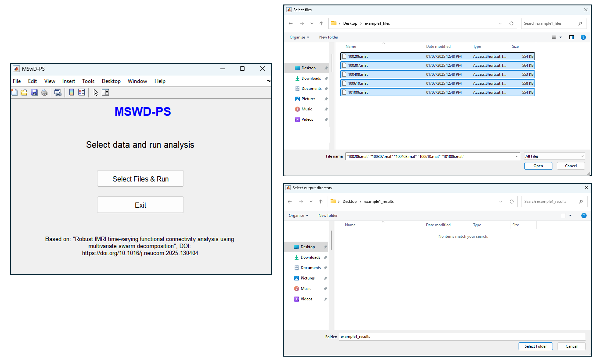
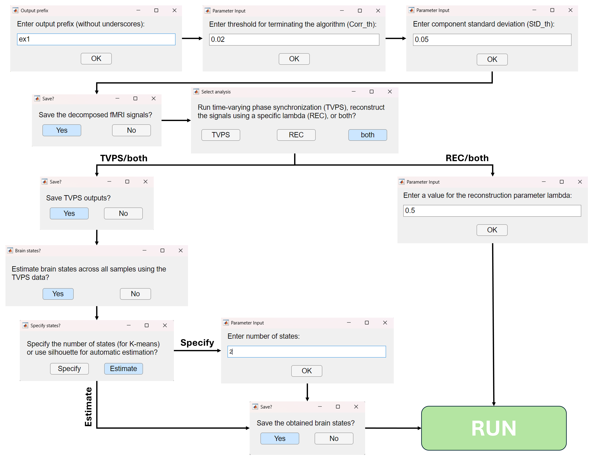

# MSwD-PS_Toolbox
MSwD-PS is a MATLAB toolbox for computing time-varying phase synchronization (TVPS) from fMRI data using multivariate swarm decomposition (MSwD).

The toolbox has two versions, the standalone version and a version compatible with the Statistical Parametric Mapping (SPM) toolbox. The standalone version is applicable to extracted fMRI time series, either via atlas-based parcellation or via spatial Independent Component Analysis (ICA). The SPM-compatible version can be applied directly on extracted rs-fMRI time series, but it also includes a parcellation module, allowing the pipeline to be applied to volumetric fMRI data as well, in an end-to-end fashion. 

Below, we provide concrete step-by-step instructions on how to initialize and use both versions (standalone and SPM-compatible) of our software.

# Standalone Version
```matlab
addpath(genpath('C:\path\to\MSWD_Toolbox'))
mswd_ps_main;
```
Then, the window showed at the left of the figure below will pop up. By clicking "Select Files & Run", two more windows will succesively open, asking for the input files and the output directory respectively.


Then, a series of additional dialog windows will successively open, asking the user to define some analysis-related parameters. An overview of these windows is shown below:


Each dialog window comes with a default option, to allow for non-familiar users to easily use the software. In multiple-choice windows the default is highlighted with light blue, while in windows asking for specific values, the default value is already pre-filled.

